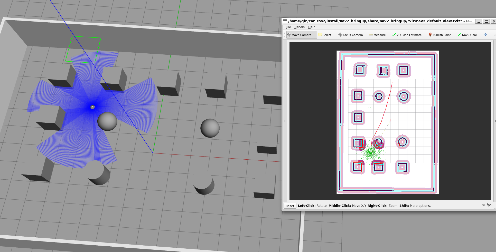

# 简介
此仓库为大创项目的巡检车存储仓库，内容为小车仿真模型以及相关的nav2导航代码

# 安装库
```
pip3 install -y numpy lark empy==3.3.4 catkin_pkg lxml
sudo apt install -y ros-humble-bondcpp
sudo apt install -y ros-humble-diagnostic-updater
sudo apt install -y ros-humble-behaviortree-cpp-v3
sudo apt install -y libgraphicsmagick++1-dev graphicsmagick-libmagick-dev-compat
sudo apt install -y libceres-dev
sudo apt install -y libxtensor-dev
sudo apt install -y libnanoflann-dev
sudo apt install -y libompl-dev
sudo apt install -y ros-humble-gazebo-ros-pkgs
```

# 拉取仓库
```
git clone https://github.com/qin343531/car_ros2.git
```

## 拉取navaigation2
```
cd car_ros2/src/
git clone https://github.com/ros-planning/navigation2.git -b humble
```

## 编译
开始编译，指定1个CPU核心编译，否则电脑容易卡死
```
cd ~/car_ros2
colcon build --parallel-workers 1 --cmake-args -DBUILD_TESTING=OFF -DCMAKE_CXX_FLAGS="-Wno-error"
```

# 脚本启动
首先要运行`ares_description/launch/qinbot_dis.launch.py`脚本
```
ros2 launch ares_description qinbot_dis.launch.py
```
这个会启动gazebo仿真页面，里面有小车仿真模型与地图

然后运行`qinbot_navigation2/launch/navigation2.launch.py`脚本
```
ros2 launch qinbot_navigation2 navigation2.launch.py
```
这个会启动导航功能，rviz界面
之后在rviz2中进行导航即可



# qinbot_ws
泰山派的ros2节点启动包，包括，slam建图，ros2的键盘控制，nav2的路径规划，激光雷达的驱动
# ros2
包括视频流和空气传感器的上传


