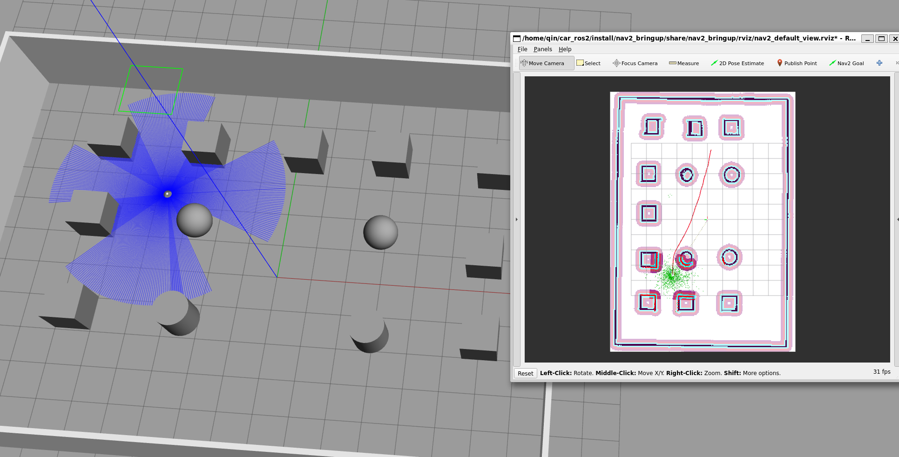

# 简介
此仓库为大创项目的巡检车存储仓库，内容为小车仿真模型以及相关的nav2导航代码

# 安装库
```
pip3 install -y numpy lark empy==3.3.4 catkin_pkg lxml
```

# 拉取仓库
```
git clone https://github.com/qin343531/qinbot_ros2.git
```

# 解压qinbot_ros2.7z

## 拉取navaigation2
```
cd qinbot_ros2/src/
git clone https://github.com/ros-planning/navigation2.git -b humble
```

## 编译
开始编译，指定1个CPU核心编译，否则电脑容易卡死
```
cd ~/car_ros2
colcon build --parallel-workers 1 --cmake-args -DBUILD_TESTING=OFF -DCMAKE_CXX_FLAGS="-Wno-error"
```

# gazebo仿真脚本启动
首先要运行`ares_description/launch/qinbot_dis.launch.py`脚本
```
ros2 launch ares_description qinbot_dis.launch.py
```
这个会启动gazebo仿真页面，里面有小车仿真模型与地图

然后运行`qinbot_navigation2/launch/navigation2.launch.py`脚本
```
ros2 launch qinbot_navigation2 navigation2.launch.py
```
这个会启动导航功能，rviz界面
之后在rviz2中进行导航即可



# qinbot_ws
泰山派的ros2节点启动包，包括，slam建图，ros2的键盘控制，nav2的路径规划，激光雷达的驱动
# ros2
包括视频流和空气传感器的上传

# 真机运行
泰山派端运行这段脚本
```
ros2 launch qinbot_car qinbot_bringup.launch.py -time_offset=-1.3
# 或者运行脚本
./start.sh
```
首先要检查一下泰山派与PC机的系统时间戳是否正确，在泰山派开启脚本后，PC运行脚本检查
```
qin@DESKTOP-CFJHFGS:~$ python monitor_laser_timestamp.py 
================================================================================
激光时间戳(秒)             系统当前时间(秒)            时间差(秒)          状态        
================================================================================
1772511324.214678    1772511324.235621    0.020943        ✅ 正常      
```
正常即可继续，否则根据时间差，调整泰山派time_offset的参数

PC端运行发布TF树脚本
```
ros2 launch qinbot_bringup qinbot_bringup.launch.py
```
PC端开启nav2路径规划
```
ros2 launch qinbot_navigation2 navigation2.launch.py
```
之后即可以开始进行路径规划了

# 建图
泰山派步骤与真机运行一致
```
ros2 launch qinbot_car qinbot_bringup.launch.py -time_offset=-1.3
# 或者运行脚本
./start.sh
```
PC运行slam_toolbox包
```
ros2 launch slam_toolbox online_async_launch.py
```
打开rviz2,然后执行
```
ros2 run teleop_twist_keyboard teleop_twist_keyboard
```

# 保存地图
运行指令保存地图
```
ros2 run nav2_map_server map_saver_cli -t map -f qinbot_map
```


